# Telco Customer Churn — Plano de Análises (MySQL + BI)

Este projeto utiliza o [Conjunto de dados público de retenção e controle de contratos em uma empresa de telecomunicação](https://www.kaggle.com/datasets/blastchar/telco-customer-churn), disponível no Kaggle.

O dataset reúne informações de rotatividade para controle de retenção de clientes em uma empresa do ramo de telecomunicação, incluindo dados de:

* customerID — ID do cliente
* gender — Gênero
* SeniorCitizen — Idoso (0/1)
* Partner — Parceiro (Yes/No)
* Dependents — Dependentes (Yes/No)
* tenure — Tempo de permanência (meses)
* PhoneService — Serviço telefônico
* MultipleLines — Múltiplas linhas / Sem linha telefônica
* InternetService — Serviço de internet (DSL/Fiber/No)
* OnlineSecurity, OnlineBackup, DeviceProtection, TechSupport — Add-ons
* StreamingTV, StreamingMovies — Streaming
* Contract — Tipo de contrato (Month-to-month / One year / Two year)
* PaperlessBilling — Faturamento digital
* PaymentMethod — Método de pagamento
* MonthlyCharges — Cobranças mensais
* TotalCharges — Cobranças totais
* Churn — Cancelamento (Yes/No)
  
## Objetivo

Medir e explicar o churn de clientes e identificar segmentos de risco e alavancas de retenção (contrato, método de pagamento, serviços, preço e tempo de casa).

## Perguntas de negócio (o que vou responder)

* Qual é a taxa de churn global?
* Como o churn varia por tipo de contrato (Monthly / One year / Two year)?
* Método de pagamento (electronic check, credit card, bank transfer, mailed check) influencia o churn?
* Qual o efeito de InternetService (DSL/Fiber/None) e de add-ons (OnlineSecurity, TechSupport, etc.) no churn?
* SeniorCitizen, Partner, Dependents alteram a probabilidade de churn?
* Faixas de preço (MonthlyCharges) x churn: onde o risco é maior?
* Tenure (tempo de casa) x churn: qual a curva de sobrevivência? Onde ocorre o “vale” de maior risco?
* Quais são as top 5 combinações de serviços com maior churn?
* Quais segmentos têm churn acima da média (uplift) e devem ser priorizados?
* Qual a perda de receita recorrente associada ao churn (aproximação)?
* Entre clientes “Month-to-month”, quais métodos de pagamento elevam/baixam o risco?
* PaperlessBilling impacta churn?

# Tratamento e Qualidade dos Dados

Objetivo do tratamento: garantir tipos corretos, lidar com valores vazios e inconsistências de formatação para viabilizar análises confiáveis no SQL/BI.

## Padronizações aplicadas

### Tipos numéricos

* MonthlyCharges → DECIMAL(7,2) (ajuste para evitar estouro; ex.: 108.50).
* TotalCharges → DECIMAL(10,2) (pode acumular valores altos).
* SeniorCitizen → INT (0/1).

### Valores vazios

Conversão de strings vazias ('') em NULL para MonthlyCharges e TotalCharges.

### Formatação numérica

* Troca de vírgula por ponto como separador decimal.
* Remoção de espaços perdidos dentro dos números (ex.: 69 994.8 → 69994.80).
* TRIM para retirar espaços extras nas extremidades.

### Observação

Linhas com tenure = 0 podem ter TotalCharges vazio por serem clientes muito novos.

## Carga com limpeza (MySQL)

```sql
LOAD DATA INFILE 'C:/ProgramData/MySQL/MySQL Server 8.0/Uploads/tele_churn/Telco-Customer-Churn.csv'
INTO TABLE customer_churn
CHARACTER SET utf8mb4
FIELDS TERMINATED BY ','  OPTIONALLY ENCLOSED BY '"'
LINES  TERMINATED BY '\r\n'   
IGNORE 1 LINES
(
  customerID, gender, SeniorCitizen, Partner, Dependents, tenure,
  PhoneService, MultipleLines, InternetService, OnlineSecurity, OnlineBackup,
  DeviceProtection, TechSupport, StreamingTV, StreamingMovies, Contract,
  PaperlessBilling, PaymentMethod,
  @MonthlyCharges,        
  @TotalCharges,
  Churn
)
SET
  MonthlyCharges = CASE
                     WHEN TRIM(@MonthlyCharges)='' THEN NULL
                     ELSE CAST(REPLACE(REPLACE(TRIM(@MonthlyCharges),' ',''), ',', '.') AS DECIMAL(7,2))
                   END,
  TotalCharges   = CASE
                     WHEN TRIM(@TotalCharges)='' THEN NULL
                     ELSE CAST(REPLACE(REPLACE(TRIM(@TotalCharges),' ',''), ',', '.') AS DECIMAL(10,2))
                   END;
```

## Qual é a taxa de churn global?

Definição: Percentual de clientes que cancelaram (`Churn = 'Yes'`) em relação ao total de clientes.

Fórmula (conceito): `churn_global = (n_cancelados / n_total) * 100`

### Query utilizada no MySQL

```sql
WITH contagem AS (
  SELECT
    COUNT(customerID) AS customers,
    SUM(Churn='Yes')  AS customers_churn 
  FROM customer_churn
)
SELECT ROUND(customers_churn * 100.0 / customers, 2) AS churn_global_pct
FROM contagem;
```

No MySQL, a expressão `Churn = 'Yes'` vira **1/0** (verdadeiro/falso). A média (`AVG`) desses valores retorna diretamente a **fração de cancelados**, evitando erros de **divisão inteira** e deixando o SQL mais limpo.

<p align="center">
  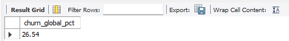
</p>

## Como o churn varia por tipo de contrato (Monthly / One year / Two year)?

Pergunta: Como o churn varia entre `Month-to-month`, `One year` e `Two year`?

Métrica utilizada: taxa de churn por contrato = (cancelados do contrato / clientes do contrato) × 100

### Query utilizada no MySQL

```sql
SELECT  Contract,
		COUNT(customerID) AS customers,
		SUM(churn='Yes')  AS customers_churn,
        ROUND(SUM(churn = 'Yes')*100 / COUNT(customerID),2) AS churn_rate 
FROM customer_churn
GROUP BY contract
ORDER BY churn_rate DESC
```

<p align="center">
  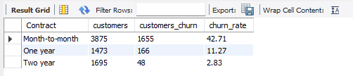
</p>

## Método de pagamento (electronic check, credit card, bank transfer, mailed check) influência o churn?

Métrica: taxa de churn por método = (cancelados do método / clientes do método) × 100.

### Query utilizada no MySQL

```sql
SELECT  PaymentMethod,
		COUNT(customerID) AS customers,
		SUM(churn='Yes')  AS customers_churn,
        ROUND(SUM(churn = 'Yes')*100 / COUNT(customerID),2) AS churn_rate 
FROM customer_churn
GROUP BY PaymentMethod
ORDER BY churn_rate DESC
```
<p align="center">
  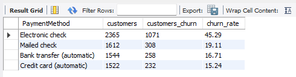
</p>

## Qual o efeito de InternetService (DSL/Fiber/None) e de Add-ons (OnlineSecurity, TechSupport, etc.) no churn?

### Criação da view `telco_features`
Para analisar todos os add-ons de forma comparável, criei uma view que transforma cada recurso em flags binárias (0/1). Assim fica simples contar bases, calcular taxas e comparar “tem” vs “não tem”.

```sql
CREATE OR REPLACE VIEW telco_features AS
SELECT
  customerID,
  is_churn,                 -- 1 = churnou, 0 = permaneceu
  InternetService,
  CASE WHEN OnlineSecurity   = 'Yes' THEN 1 ELSE 0 END AS f_Security,
  CASE WHEN OnlineBackup     = 'Yes' THEN 1 ELSE 0 END AS f_Backup,
  CASE WHEN DeviceProtection = 'Yes' THEN 1 ELSE 0 END AS f_Protection,
  CASE WHEN TechSupport      = 'Yes' THEN 1 ELSE 0 END AS f_Support,
  CASE WHEN StreamingTV      = 'Yes' THEN 1 ELSE 0 END AS f_TV,
  CASE WHEN StreamingMovies  = 'Yes' THEN 1 ELSE 0 END AS f_Movies
FROM telco_clean;
```
Podemos fazer essa analise de duas formas, uma com diversas queries separadas e analisar cada, ou fazer apenas uma query montando uma tabela geral com uma análise mais focada.
Decidi seguir com apenas uma query, assim conseguimos visualizar melhor o que cada dado representa.

### Query utilizada no MySQL

```sql
WITH g AS (
  SELECT SUM(is_churn)/COUNT(*) AS churn_global FROM telco_features
)
SELECT * FROM (
  SELECT 'OnlineSecurity' AS feature,
         SUM(f_Security)                                      AS users_with,
         ROUND(SUM(CASE WHEN f_Security=1 THEN is_churn END) / NULLIF(SUM(f_Security),0),4)           AS churn_with,
         ROUND(SUM(CASE WHEN f_Security=0 THEN is_churn END) / NULLIF(SUM(1-f_Security),0),4)         AS churn_without,
         ROUND(
           (SUM(CASE WHEN f_Security=1 THEN is_churn END)/NULLIF(SUM(f_Security),0)) -
           (SUM(CASE WHEN f_Security=0 THEN is_churn END)/NULLIF(SUM(1-f_Security),0)),4)             AS uplift,
         (SELECT churn_global FROM g) AS churn_global
  FROM telco_features
  UNION ALL
  SELECT 'OnlineBackup',
         SUM(f_Backup),
         ROUND(SUM(CASE WHEN f_Backup=1 THEN is_churn END)/NULLIF(SUM(f_Backup),0),4),
         ROUND(SUM(CASE WHEN f_Backup=0 THEN is_churn END)/NULLIF(SUM(1-f_Backup),0),4),
         ROUND(
           (SUM(CASE WHEN f_Backup=1 THEN is_churn END)/NULLIF(SUM(f_Backup),0)) -
           (SUM(CASE WHEN f_Backup=0 THEN is_churn END)/NULLIF(SUM(1-f_Backup),0)),4),
         (SELECT churn_global FROM g)
  FROM telco_features
  UNION ALL
  SELECT 'DeviceProtection',
         SUM(f_Protection),
         ROUND(SUM(CASE WHEN f_Protection=1 THEN is_churn END)/NULLIF(SUM(f_Protection),0),4),
         ROUND(SUM(CASE WHEN f_Protection=0 THEN is_churn END)/NULLIF(SUM(1-f_Protection),0),4),
         ROUND(
           (SUM(CASE WHEN f_Protection=1 THEN is_churn END)/NULLIF(SUM(f_Protection),0)) -
           (SUM(CASE WHEN f_Protection=0 THEN is_churn END)/NULLIF(SUM(1-f_Protection),0)),4),
         (SELECT churn_global FROM g)
  FROM telco_features
  UNION ALL
  SELECT 'TechSupport',
         SUM(f_Support),
         ROUND(SUM(CASE WHEN f_Support=1 THEN is_churn END)/NULLIF(SUM(f_Support),0),4),
         ROUND(SUM(CASE WHEN f_Support=0 THEN is_churn END)/NULLIF(SUM(1-f_Support),0),4),
         ROUND(
           (SUM(CASE WHEN f_Support=1 THEN is_churn END)/NULLIF(SUM(f_Support),0)) -
           (SUM(CASE WHEN f_Support=0 THEN is_churn END)/NULLIF(SUM(1-f_Support),0)),4),
         (SELECT churn_global FROM g)
  FROM telco_features
  UNION ALL
  SELECT 'StreamingTV',
         SUM(f_TV),
         ROUND(SUM(CASE WHEN f_TV=1 THEN is_churn END)/NULLIF(SUM(f_TV),0),4),
         ROUND(SUM(CASE WHEN f_TV=0 THEN is_churn END)/NULLIF(SUM(1-f_TV),0),4),
         ROUND(
           (SUM(CASE WHEN f_TV=1 THEN is_churn END)/NULLIF(SUM(f_TV),0)) -
           (SUM(CASE WHEN f_TV=0 THEN is_churn END)/NULLIF(SUM(1-f_TV),0)),4),
         (SELECT churn_global FROM g)
  FROM telco_features
  UNION ALL
  SELECT 'StreamingMovies',
         SUM(f_Movies),
         ROUND(SUM(CASE WHEN f_Movies=1 THEN is_churn END)/NULLIF(SUM(f_Movies),0),4),
         ROUND(SUM(CASE WHEN f_Movies=0 THEN is_churn END)/NULLIF(SUM(1-f_Movies),0),4),
         ROUND(
           (SUM(CASE WHEN f_Movies=1 THEN is_churn END)/NULLIF(SUM(f_Movies),0)) -
           (SUM(CASE WHEN f_Movies=0 THEN is_churn END)/NULLIF(SUM(1-f_Movies),0)),4),
         (SELECT churn_global FROM g)
  FROM telco_features
) t
ORDER BY uplift DESC;
```

Com essa query mais estensa colocamos filtros diferentes usando o CASE WHEN para filtrar dados onde a função esta positiva (1), e quando esta negativa (0).

<p align="center">
  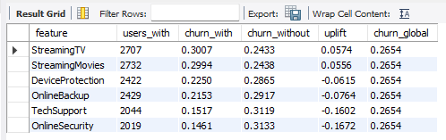
</p>

A análise mostra que o tipo de serviço de internet e os add-ons contratados têm impacto direto nas taxas de churn:

- InternetService
  - Clientes com Fiber optic tendem a ter churn mais alto, possivelmente por causa de preço ou perfil mais sensível a custos.
  - Clientes com DSL apresentam churn menor em comparação.
  - Quem não possui serviço de internet geralmente apresenta churn ainda mais baixo, mas também têm ticket médio reduzido.

- Add-ons de Segurança e Suporte
  - OnlineSecurity e TechSupport estão associados a forte redução no churn (uplift negativo de até ~16 pontos percentuais).  
  - Isso sugere que clientes que contam com proteção e suporte percebem mais valor e permanecem mais tempo.

- Add-ons de Backup e Proteção
  - OnlineBackup e DeviceProtection também reduzem o churn, mas em menor escala (cerca de −6 a −8 pp).  
  - Ainda assim, contribuem para a fidelização.

- Add-ons de Entretenimento
  - StreamingTV e StreamingMovies estão associados a maior churn (uplift positivo de ~+6 pp).  
  - Isso pode indicar que usuários que contratam apenas entretenimento são mais sensíveis a preço ou estão em planos de contrato mensal, mais fáceis de cancelar.

### Interpretação
- Add-ons de segurança e suporte funcionam como fatores de retenção, fortalecendo o vínculo do cliente.  
- Add-ons de entretenimento aumentam o risco de saída, exigindo estratégias específicas (como bundles com segurança ou descontos em contratos anuais).  
- O uplift mede essa diferença: se negativo, o recurso ajuda a reduzir churn; se positivo, aumenta o risco.  

## SeniorCitizen, Partner, Dependents alteram a probabilidade de churn?

Para complementar a análise de add-ons e serviços, também foi avaliado o impacto de características demográficas no churn. 
As variáveis foram tratadas como flags binárias (0/1), o que permitiu calcular as taxas de churn de forma consistente entre os grupos.

### Criação da view `telco_life`:

```sql
CREATE OR REPLACE VIEW telco_life AS 
SELECT 
  customerID,
  is_churn,
  SeniorCitizen,
  CASE WHEN Partner    = 'Yes' THEN 1 ELSE 0 END AS is_partner,
  CASE WHEN Dependents = 'Yes' THEN 1 ELSE 0 END AS is_dependents
FROM telco_clean;
```

### Metodologia
- `SUM(flag)` → total de clientes em cada grupo.  
- `SUM(CASE WHEN flag=1 THEN is_churn END)/SUM(flag)` → taxa de churn entre quem tem a característica.  
- `SUM(CASE WHEN flag=0 THEN is_churn END)/SUM(1-flag)` → taxa de churn entre quem não tem.  
- `uplift` → diferença entre as duas taxas, em pontos percentuais.  
- `global_churn` → taxa média geral da base, usada como referência.

```sql
WITH g AS (
	SELECT SUM(is_churn)/COUNT(is_churn) AS global_churn
	FROM telco_life
)
SELECT 
		'SeniorCitizen' AS feature,
        SUM(SeniorCitizen) AS users_with,
		ROUND(SUM(CASE WHEN SeniorCitizen = 1 THEN is_churn END) / NULLIF(SUM(SeniorCitizen),0),4) AS churn_with,
		ROUND(SUM(CASE WHEN SeniorCitizen = 0 THEN is_churn END) / NULLIF(SUM(1-SeniorCitizen),0),4) AS churn_without,
        ROUND(
			  (SUM(CASE WHEN SeniorCitizen = 1 THEN is_churn END) / NULLIF(SUM(SeniorCitizen),0)) -
              (SUM(CASE WHEN SeniorCitizen = 0 THEN is_churn END) / NULLIF(SUM(1-SeniorCitizen),0)),4) AS uplift,
        (SELECT SUM(is_churn)/COUNT(is_churn) FROM g) AS global_churn
FROM telco_life
UNION ALL
SELECT 
		'Partner',
        SUM(is_partner),
		ROUND(SUM(CASE WHEN is_partner = 1 THEN is_churn END) / NULLIF(SUM(is_partner),0),4),
		ROUND(SUM(CASE WHEN is_partner = 0 THEN is_churn END) / NULLIF(SUM(1-is_partner),0),4),
		ROUND(
			  (SUM(CASE WHEN is_partner = 1 THEN is_churn END) / NULLIF(SUM(is_partner),0)) -
              (SUM(CASE WHEN is_partner = 0 THEN is_churn END) / NULLIF(SUM(1-is_partner),0)),4),
        (SELECT SUM(is_churn)/COUNT(is_churn) FROM g)
FROM telco_life
UNION ALL
SELECT 
		'Dependents',
        SUM(is_dependents),
		ROUND(SUM(CASE WHEN is_dependents= 1 THEN is_churn END) / NULLIF(SUM(is_dependents),0),4),
		ROUND(SUM(CASE WHEN is_dependents= 0 THEN is_churn END) / NULLIF(SUM(1-is_dependents),0),4),
		ROUND(
			  (SUM(CASE WHEN is_dependents = 1 THEN is_churn END) / NULLIF(SUM(is_dependents),0)) -
              (SUM(CASE WHEN is_dependents = 0 THEN is_churn END) / NULLIF(SUM(1-is_dependents),0)),4),
        (SELECT SUM(is_churn)/COUNT(is_churn) FROM g)
FROM telco_life;
```
<p align="center">
  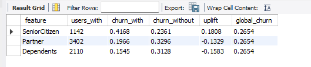
</p>

### Conclusão
Os resultados indicam que fatores demográficos estão fortemente associados ao churn:

- SeniorCitizes: Clientes idosos apresentam uma taxa de churn de 41,68%, significativamente acima da média global (26,54%). O *uplift* de +18,08pp indica que esse grupo tem uma propensão muito maior a abandonar o serviço, sendo um público que merece atenção especial em estratégias de retenção.
- Partner: Clientes que possuem um parceiro(a) apresentam uma taxa de churn menor (19,66%) quando comparados aos que não têm (32,96%). O *uplift* negativo de -13,29pp sugere que ter um parceiro está relacionado a uma maior fidelização.
- Dependents: Usuários com dependentes também são menos propensos a churn (15,45%) em relação aos que não têm dependentes (31,28%), com um *uplift* de -15,83pp, o que reforça a tendência de maior estabilidade em clientes com vínculos familiares.

Essas informações são valiosas para segmentação de campanhas de retenção, já que permitem priorizar grupos de maior risco (idosos sem parceiro/dependentes) com ofertas ou suporte direcionado.

## Faixas de preço (MonthlyCharges) x churn: onde o risco é maior?

O objetivo dessa análise é verificar se o valor cobrado mensalmente (MonthlyCharges) influencia na taxa de cancelamento dos clientes (churn). Para isso, os clientes foram segmentados em três grupos de faixas de preço:
* low_price: até R$40
* medium_price: entre R$40 e R$80
* high_price: acima de R$80

```sql
SELECT MAX(MonthlyCharges) AS max_charge,
	   MIN(MonthlyCharges) AS min_charge,
	   ROUND(AVG(MonthlyCharges),2) AS avg_charge
FROM customer_churn;
```
<p align="center">
  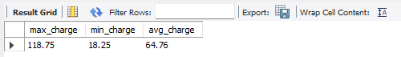
</p>

### Criação da view

Essa view facilita a segmentação dos clientes de acordo com a faixa de preço, para posterior análise comparativa do churn.

```sql
CREATE OR REPLACE VIEW telco_price AS
SELECT 
  customerID,
  is_churn,
  MonthlyCharges,
  CASE 
    WHEN MonthlyCharges <= 40 THEN 'low_price'
    WHEN MonthlyCharges <= 80 THEN 'medium_price'
    ELSE 'high_price'
  END AS price_tier
FROM telco_clean;
```
### Query de Análise por Faixa de Preço

```sql
WITH g AS (
	SELECT SUM(is_churn)/COUNT(is_churn) AS global_churn
	FROM telco_price
)
SELECT 
		'Low Price' AS tier,
		SUM(CASE WHEN price_tier = 'low_price' THEN 1 END) AS sum_tier,
		ROUND(SUM(CASE WHEN price_tier = 'low_price' THEN is_churn END) / NULLIF(SUM(CASE WHEN price_tier = 'low_price' THEN 1 END),0),4) AS churn_with,
		ROUND(SUM(CASE WHEN price_tier <> 'low_price' THEN is_churn END) / NULLIF(SUM(CASE WHEN price_tier <> 'low_price' THEN 1 END),0),4) AS churn_without,
		ROUND(
				(SUM(CASE WHEN price_tier = 'low_price' THEN is_churn END) / NULLIF(SUM(CASE WHEN price_tier = 'low_price' THEN 1 END),0)) -
				(SUM(CASE WHEN price_tier <> 'low_price' THEN is_churn END) / NULLIF(SUM(CASE WHEN price_tier <> 'low_price' THEN 1 END),0)),4) AS uplift,
        (SELECT SUM(is_churn)/COUNT(is_churn) FROM g) AS global_churn
FROM telco_price
UNION ALL
SELECT 
		'Medium Price' ,
		SUM(CASE WHEN price_tier = 'medium_price' THEN 1 END) ,
		ROUND(SUM(CASE WHEN price_tier = 'medium_price' THEN is_churn END) / NULLIF(SUM(CASE WHEN price_tier = 'medium_price' THEN 1 END),0),4) ,
		ROUND(SUM(CASE WHEN price_tier <> 'medium_price' THEN is_churn END) / NULLIF(SUM(CASE WHEN price_tier <> 'medium_price' THEN 1 END),0),4),
		ROUND(
				(SUM(CASE WHEN price_tier = 'medium_price' THEN is_churn END) / NULLIF(SUM(CASE WHEN price_tier = 'medium_price' THEN 1 END),0)) -
				(SUM(CASE WHEN price_tier <> 'medium_price' THEN is_churn END) / NULLIF(SUM(CASE WHEN price_tier <> 'medium_price' THEN 1 END),0)),4) ,
        (SELECT SUM(is_churn)/COUNT(is_churn) FROM g) 
FROM telco_price
UNION ALL
SELECT 
		'High Price' ,
		SUM(CASE WHEN price_tier = 'high_price' THEN 1 END) ,
		ROUND(SUM(CASE WHEN price_tier = 'high_price' THEN is_churn END) / NULLIF(SUM(CASE WHEN price_tier = 'high_price' THEN 1 END),0),4) ,
		ROUND(SUM(CASE WHEN price_tier <> 'high_price' THEN is_churn END) / NULLIF(SUM(CASE WHEN price_tier <> 'high_price' THEN 1 END),0),4),
		ROUND(
				(SUM(CASE WHEN price_tier = 'high_price' THEN is_churn END) / NULLIF(SUM(CASE WHEN price_tier = 'high_price' THEN 1 END),0)) -
				(SUM(CASE WHEN price_tier <> 'high_price' THEN is_churn END) / NULLIF(SUM(CASE WHEN price_tier <> 'high_price' THEN 1 END),0)),4) ,
        (SELECT SUM(is_churn)/COUNT(is_churn) FROM g) 
FROM telco_price;
```
<p align="center">
  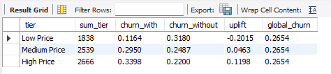
</p>

### Conclusão

A análise das faixas de preço mostra um padrão claro:

- Low Price (até R$40): clientes nessa faixa apresentam a menor taxa de churn (11,64%), bem abaixo da média global (26,54%). O *uplift* negativo de -20,15pp indica que planos baratos funcionam como fator de retenção.
- Medium Price (R$40 a R$80): esses clientes têm churn de 29,50%, ligeiramente acima da média, com *uplift* de +4,63pp, sugerindo maior vulnerabilidade ao cancelamento nessa faixa intermediária.
- High Price (acima de R$80): clientes de planos caros apresentam a maior taxa de churn (33,98%), com *uplift* positivo de +11,98pp, mostrando que quanto mais alto o valor da mensalidade, maior a chance de cancelamento.

Em resumo:  
- Preços mais baixos estão associados à fidelização.  
- Planos médios apresentam risco moderado.  
- Planos caros têm o maior risco de churn, evidenciando uma possível percepção negativa de custo-benefício pelos clientes.  

Esses achados reforçam a necessidade de estratégias de retenção específicas para clientes de alta mensalidade, como descontos progressivos, pacotes ou contratos de longo prazo.

## Tenure (tempo de casa) x churn: qual a curva de sobrevivência? Onde ocorre o “vale” de maior risco?

Investigar se o tempo que o cliente permanece na empresa (tenure) influencia sua propensão ao churn. A pergunta-chave é:
Existe um “vale” de maior risco em que o cliente tem mais chance de cancelar o serviço?

### Levantamento estatístico básico do campo tenure

Primeiramente, foi realizado um levantamento estatístico básico do campo tenure:
* Máximo tenure: indica o tempo máximo de permanência,
* Mínimo tenure: tempo mínimo de permanência,
* Média tenure: média de tempo dos clientes com a empresa.

```sql
SELECT MAX(tenure) AS max_tenure,
	   MIN(tenure) AS min_tenure,
	   ROUND(AVG(tenure),2) AS avg_tenure
FROM customer_churn;
```

<p align="center">
  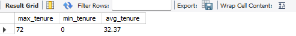
</p>

### Criação da View `telco_tenure`

Para facilitar a análise, os clientes foram segmentados em faixas de tempo de casa (tenure):

```sql
CREATE OR REPLACE VIEW telco_tenure AS
SELECT 
  customerID,
  is_churn,
  tenure,
  CASE 
    WHEN tenure <= 12 THEN 'low_tenure' 
    WHEN tenure <= 24 THEN 'medium_tenure'
    ELSE 'high_tenure'
  END AS tenure_tier
FROM telco_clean;
```
Classificação usada:
* low_tenure: até 12 meses
* medium_tenure: de 13 a 24 meses
* high_tenure: acima de 24 meses

### Cálculo de Churn por Faixa de Tenure

A seguir, foi feito o cálculo das taxas de churn dentro de cada faixa e o uplift (diferença da taxa em relação ao restante dos clientes):

```sql
WITH g AS (
	SELECT SUM(is_churn)/COUNT(is_churn) AS global_churn
	FROM telco_tenure
)
SELECT 
		'Low Tenure' AS tier,
		SUM(CASE WHEN tenure_tier = 'low_tenure' THEN 1 END) AS sum_tenure,
		ROUND(SUM(CASE WHEN tenure_tier = 'low_tenure' THEN is_churn END) / NULLIF(SUM(CASE WHEN tenure_tier = 'low_tenure' THEN 1 END),0),4) AS churn_with,
		ROUND(SUM(CASE WHEN tenure_tier <> 'low_tenure' THEN is_churn END) / NULLIF(SUM(CASE WHEN tenure_tier <> 'low_tenure' THEN 1 END),0),4) AS churn_without,
		ROUND(
				(SUM(CASE WHEN tenure_tier = 'low_tenure' THEN is_churn END) / NULLIF(SUM(CASE WHEN tenure_tier = 'low_tenure' THEN 1 END),0)) -
				(SUM(CASE WHEN tenure_tier <> 'low_tenure' THEN is_churn END) / NULLIF(SUM(CASE WHEN tenure_tier <> 'low_tenure' THEN 1 END),0)),4) AS uplift,
        (SELECT SUM(is_churn)/COUNT(is_churn) FROM g) AS global_churn
FROM telco_tenure
UNION ALL
SELECT 
		'Medium Tenure' ,
		SUM(CASE WHEN tenure_tier = 'medium_tenure' THEN 1 END) ,
		ROUND(SUM(CASE WHEN tenure_tier = 'medium_tenure' THEN is_churn END) / NULLIF(SUM(CASE WHEN tenure_tier = 'medium_tenure' THEN 1 END),0),4) ,
		ROUND(SUM(CASE WHEN tenure_tier <> 'medium_tenure' THEN is_churn END) / NULLIF(SUM(CASE WHEN tenure_tier <> 'medium_tenure' THEN 1 END),0),4),
		ROUND(
				(SUM(CASE WHEN tenure_tier ='medium_tenure' THEN is_churn END) / NULLIF(SUM(CASE WHEN tenure_tier = 'medium_tenure' THEN 1 END),0)) -
				(SUM(CASE WHEN tenure_tier <> 'medium_tenure' THEN is_churn END) / NULLIF(SUM(CASE WHEN tenure_tier <> 'medium_tenure' THEN 1 END),0)),4) ,
        (SELECT SUM(is_churn)/COUNT(is_churn) FROM g) 
FROM telco_tenure
UNION ALL
SELECT 
		'High Tenure' ,
		SUM(CASE WHEN tenure_tier = 'high_tenure' THEN 1 END) ,
		ROUND(SUM(CASE WHEN tenure_tier = 'high_tenure' THEN is_churn END) / NULLIF(SUM(CASE WHEN tenure_tier = 'high_tenure' THEN 1 END),0),4) ,
		ROUND(SUM(CASE WHEN tenure_tier <> 'high_tenure' THEN is_churn END) / NULLIF(SUM(CASE WHEN tenure_tier <> 'high_tenure' THEN 1 END),0),4),
		ROUND(
				(SUM(CASE WHEN tenure_tier = 'high_tenure' THEN is_churn END) / NULLIF(SUM(CASE WHEN tenure_tier = 'high_tenure' THEN 1 END),0)) -
				(SUM(CASE WHEN tenure_tier <> 'high_tenure' THEN is_churn END) / NULLIF(SUM(CASE WHEN tenure_tier <> 'high_tenure' THEN 1 END),0)),4) ,
        (SELECT SUM(is_churn)/COUNT(is_churn) FROM g) 
FROM telco_tenure;
```

<p align="center">
  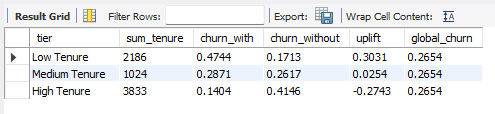
</p>

### Conclusão

- O maior risco de churn está concentrado nos primeiros 12 meses de contrato. 
- Clientes com pouco tempo de casa têm uma taxa de churn 30 pontos percentuais maior do que a média, indicando um "vale de risco" nos estágios iniciais da jornada do cliente.
- Já os clientes com longos períodos de contrato (acima de 24 meses) apresentam comportamento inverso, com baixa propensão ao churn e efeito positivo na retenção.
- O grupo de tenure médio (entre 13 e 24 meses) mostra pouca variação em relação à média global de churn (26,5%).

Recomendações: Investir em programas de onboarding, benefícios exclusivos nos primeiros meses e estratégias de engajamento desde o início pode reduzir significativamente o churn nos estágios mais críticos.

## Quais são as top 5 combinações de serviços com maior churn?

Para descobrir quais combinações de serviços estão mais associadas à evasão de clientes, foi construída uma query que agrupa todos os serviços contratados por cada cliente em uma única string (`service_combo`) e, em seguida, calcula a taxa de churn para cada combinação.

### Query utilizada: 

 ```sql
WITH churn_global AS (
    SELECT 
        COUNT(*) AS total_customers,
        SUM(CASE WHEN Churn = 'Yes' THEN 1 ELSE 0 END) AS churned_customers,
        ROUND(AVG(CASE WHEN Churn = 'Yes' THEN 1.0 ELSE 0 END), 4) AS churn_rate
    FROM telco_clean
),
churn_by_combo AS (
    SELECT 
        CONCAT_WS(' + ',
		CASE WHEN PhoneService = 'Yes' THEN 'Phone' END,
		CASE WHEN InternetService = 'DSL' THEN 'Internet_DSL' END,
		CASE WHEN InternetService = 'Fiber optic' THEN 'Internet_FiberOptic' END,
		CASE WHEN OnlineSecurity = 'Yes' THEN 'OnlineSecurity' END,
		CASE WHEN OnlineBackup = 'Yes' THEN 'OnlineBackup' END,
		CASE WHEN DeviceProtection = 'Yes' THEN 'DeviceProtection' END,
		CASE WHEN TechSupport = 'Yes' THEN 'TechSupport' END,
		CASE WHEN StreamingTV = 'Yes' THEN 'StreamingTV' END,
		CASE WHEN StreamingMovies = 'Yes' THEN 'StreamingMovies' END
        ) AS service_combo,
        COUNT(*) AS total_customers,
        SUM(CASE WHEN Churn = 'Yes' THEN 1 ELSE 0 END) AS churned_customers,
        ROUND(AVG(CASE WHEN Churn = 'Yes' THEN 1.0 ELSE 0 END), 4) AS churn_rate
    FROM telco_clean
    GROUP BY service_combo
)
SELECT 
    cb.service_combo,
    cb.total_customers,
    cb.churned_customers,
    cb.churn_rate,
    g.churn_rate AS global_churn_rate,
    ROUND(cb.churn_rate - g.churn_rate, 4) AS diff_vs_global
FROM churn_by_combo cb
CROSS JOIN churn_global g
WHERE cb.service_combo IS NOT NULL
ORDER BY cb.churn_rate DESC
LIMIT 5;
```

<p align="center">
  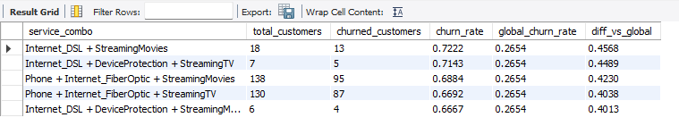
</p>

### Conclusão

Com base na análise do churn por combinações de serviços, foi possível identificar padrões relevantes que merecem atenção estratégica:

- Top 5 combinações de serviços com maior churn apresentam taxas superiores a 66%, significativamente acima da média global de 26,5%.
- A combinação “Internet_DSL + StreamingMovies” lidera o ranking com 72,22% de churn, representando um aumento de 45,68 pontos percentuais em relação à média global.
- Outras combinações que envolvem Device Protection e StreamingTV também aparecem com alta evasão, sugerindo que o excesso de serviços agregados pode estar associado a maior insatisfação ou custo percebido.
- A análise utilizou a função `CONCAT_WS()` no SQL para formar combinações únicas de serviços por cliente, permitindo agrupar dados de forma eficiente e identificar padrões de churn por combo.
- A métrica diff_vs_global comparou cada combo diretamente com a média global, tornando evidente onde o risco de cancelamento é mais crítico.

Esse tipo de análise é fundamental para decisões estratégicas de oferta de pacotes, precificação, foco em retenção e melhoria da experiência do cliente.

## Quais segmentos têm churn acima da média (uplift) e devem ser priorizados?

Nesta etapa do projeto, precisamos identificar combinações específicas de serviços associadas a uma taxa de cancelamento (churn) significativamente superior à média geral. 
O objetivo foi destacar grupos prioritários de clientes que devem ser o foco de estratégias de retenção mais incisivas.

Utilizando SQL avançado, combinamos variáveis demográficas (como SeniorCitizen, Partner, Dependents) com características contratuais e de serviços (InternetService, StreamingTV, PaymentMethod, entre outras) para formar "combos de serviço" personalizados.
A função CONCAT_WS foi essencial para construir descrições dinâmicas e legíveis dessas combinações.

Além disso, foi realizado o cálculo da taxa de churn global e, para cada combo, o diferencial (diff_vs_global) — representando o "uplift" da taxa de churn daquela combinação em relação à média da base.

### Query utilizada 

```sql
WITH churn_global AS (
    SELECT 
        COUNT(*) AS total_customers,
        SUM(CASE WHEN Churn = 'Yes' THEN 1 ELSE 0 END) AS churned_customers,
        ROUND(AVG(CASE WHEN Churn = 'Yes' THEN 1.0 ELSE 0 END), 4) AS churn_rate
    FROM telco_clean
),
churn_by_combo AS (
    SELECT 
        CONCAT_WS(' + ',
        CASE WHEN SeniorCitizen = 1 THEN 'Senior' END,
        CASE WHEN Partner = 'Yes' THEN 'Partner' END,
        CASE WHEN Dependents = 'Yes' THEN 'Dependents' END,
		CASE WHEN PhoneService = 'Yes' THEN 'Phone' END,
		CASE WHEN InternetService = 'DSL' THEN 'Internet_DSL' END,
		CASE WHEN InternetService = 'Fiber optic' THEN 'Internet_FiberOptic' END,
		CASE WHEN OnlineSecurity = 'Yes' THEN 'OnlineSecurity' END,
		CASE WHEN OnlineBackup = 'Yes' THEN 'OnlineBackup' END,
		CASE WHEN DeviceProtection = 'Yes' THEN 'DeviceProtection' END,
		CASE WHEN TechSupport = 'Yes' THEN 'TechSupport' END,
		CASE WHEN StreamingTV = 'Yes' THEN 'StreamingTV' END,
		CASE WHEN StreamingMovies = 'Yes' THEN 'StreamingMovies' END,
		CASE WHEN Contract = 'One year' THEN 'Contr. One Year' END,
		CASE WHEN Contract = 'Two year' THEN 'Contr. Two years' END,
		CASE WHEN Contract = 'Month-to-month' THEN 'Contr. Month-to-month' END,
		CASE WHEN PaymentMethod = 'Mailed check' THEN 'Paym. Mailed' END,
		CASE WHEN PaymentMethod = 'Electronic check' THEN 'Paym. Electronic' END,
		CASE WHEN PaymentMethod = 'Credit card (automatic)' THEN 'Paym. Credit card' END,
		CASE WHEN PaymentMethod = 'Bank transfer (automatic)' THEN 'Paym. Bank transfer' END,
		CASE WHEN PaperlessBilling = 'Yes' THEN 'Paper Bill' END
        ) AS service_combo,
        COUNT(*) AS total_customers,
        SUM(CASE WHEN Churn = 'Yes' THEN 1 ELSE 0 END) AS churned_customers,
        ROUND(AVG(CASE WHEN Churn = 'Yes' THEN 1.0 ELSE 0 END), 4) AS churn_rate
    FROM telco_clean
    GROUP BY service_combo
    HAVING COUNT(*) >= 15
)
SELECT 
    cb.service_combo,
    cb.total_customers,
    cb.churned_customers,
    cb.churn_rate,
    g.churn_rate AS global_churn_rate,
    ROUND(cb.churn_rate - g.churn_rate, 4) AS diff_vs_global
FROM churn_by_combo cb
CROSS JOIN churn_global g
WHERE cb.service_combo IS NOT NULL
ORDER BY cb.churn_rate DESC
LIMIT 10;
```

<p align="center">
  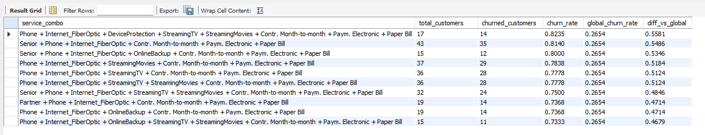
</p>

### Conclusão

A análise revelou que alguns combos de serviços apresentam taxas de churn superiores a 75%, mais que o triplo da taxa global (~26%). Os clientes que possuem contrato mensal + fibra ótica + débito eletrônico + serviços de streaming, por exemplo, estão entre os mais propensos a cancelar.

Esses resultados ajudam a definir segmentos de alto risco, que devem ser tratados com ofertas personalizadas, reforço de suporte ou campanhas de fidelização.

## Qual a perda de receita recorrente associada ao churn (aproximação)?

Esta análise tem como objetivo estimar a perda de receita mensal recorrente associada ao cancelamento de clientes (churn) utilizando a base de dados `telco_clean`.

### Query utilizada

```sql
SELECT 
		COUNT(*) AS total_clientes,
		COUNT(CASE WHEN is_churn = 1 THEN is_churn END)     AS clientes_que_cancelaram,
        ROUND(100 * COUNT(CASE WHEN is_churn = 1 THEN is_churn END)/ COUNT(*),2)  AS clientes_cancelaram_pct,
		ROUND(SUM(monthlycharges),2) AS renda_mensal,
        ROUND(SUM(CASE WHEN is_churn = 1 THEN monthlycharges END),2) AS perda_rendamensal,
        ROUND(100*SUM(CASE WHEN is_churn = 1 THEN monthlycharges END) / SUM(monthlycharges),2) AS perda_renda_pct
FROM telco_clean;
```

<p align="center">
  
</p>

### Conclusão

Com base na análise, observamos que aproximadamente 26,5% dos clientes cancelaram seus serviços, representando uma perda de 30,5% da receita mensal da empresa. 

## Entre clientes “Month-to-month”, quais métodos de pagamento elevam/baixam o risco?

A análise calculou a taxa de churn para cada método de pagamento e comparou com a taxa global de churn da base para esse grupo, gerando dois indicadores principais:
* churn_pct_grupo: taxa de churn daquele grupo específico
* uplift: diferença entre o churn do grupo e o churn global
* churn_pct_total: razão entre a taxa do grupo e a taxa global

### Query utilizada

```sql
WITH g AS (
	SELECT SUM(is_churn)/COUNT(is_churn) AS global_churn
	FROM telco_clean
)
SELECT
		PaymentMethod,
        SUM(CASE WHEN is_churn = 1 THEN 1 END) AS churn_sum,
        ROUND(COUNT(CASE WHEN is_churn = 1 THEN 1 END) / COUNT(*), 4) AS churn_pct_grupo,
        (SELECT global_churn FROM g) AS global_churn,
        ROUND((COUNT(CASE WHEN is_churn = 1 THEN 1 END) / COUNT(*))/ (SELECT global_churn FROM g),4) AS churn_pct_total,
        ROUND(
			(COUNT(CASE WHEN is_churn = 1 THEN 1 END) / COUNT(*)) -
            (SELECT global_churn FROM g),4
		) AS uplift
FROM telco_clean
WHERE contract = 'Month-to-month'
GROUP BY PaymentMethod
ORDER BY churn_pct_grupo DESC;
```
<p align="center">
  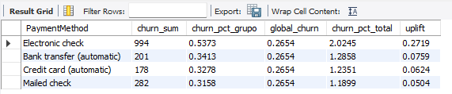
</p>

### Conclusão

A forma de pagamento com maior impacto negativo na retenção foi o "Electronic check", com uma taxa de churn de 53,73%, mais que o dobro da média global, apresentando um uplift de +27,19 pontos percentuais.

Métodos automáticos de pagamento, como transferência bancária automática e cartão de crédito automático, apresentaram churn significativamente menor, ainda que acima da média, sugerindo maior estabilidade no relacionamento com o cliente.

O pagamento via cheque enviado por correio (Mailed check) também demonstrou churn acima da média, mas com menor impacto.

## PaperlessBilling impacta churn?

O atributo PaperlessBilling indica se o cliente optou por receber a fatura em formato digital (sim = 'Yes') ou se ainda recebe em papel ('No'). 
É uma variável categórica binária que pode refletir nível de digitalização, comportamento, conveniência e até engajamento com a empresa.

```sql
WITH g AS (
	SELECT SUM(is_churn)/COUNT(is_churn) AS global_churn
	FROM telco_clean
)
SELECT 
	PaperlessBilling,
	COUNT(*) AS total_clientes,
	SUM(is_churn) AS churn_count,
	ROUND(AVG(is_churn), 4) AS churn_pct,
	(SELECT global_churn FROM g) AS global_churn,
	ROUND(AVG(is_churn) - (SELECT global_churn FROM g), 4) AS uplift,
	ROUND(AVG(is_churn) / (SELECT global_churn FROM g), 2) AS churn_pct_total
FROM telco_clean
GROUP BY PaperlessBilling;
```
<p align="center">
  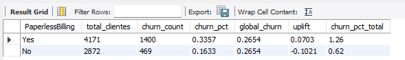
</p>

### Conclusão

A análise mostra que clientes que optam por fatura digital (PaperlessBilling = Yes) possuem uma taxa de churn significativamente maior (33.57%) do que aqueles que recebem fatura impressa (16.33%).
* A taxa global de churn da base é de 26.54%.
* O uplift para clientes com PaperlessBilling é de +7.03 pontos percentuais acima da média global.
* Já os clientes sem PaperlessBilling estão 10.21 pontos abaixo da média.

Interpretação: clientes com fatura digital têm 1,26 vezes mais chance de cancelar o serviço do que a média. Isso pode estar associado à facilidade de cancelar digitalmente, menor engajamento físico com a marca ou perfil de cliente mais volátil.

# Conclusão do projeto Telco Customer Churn

O estudo de Churn de Clientes da Telco permitiu compreender com profundidade os fatores que mais impactam a evasão e a fidelização na base de clientes. 
Através de consultas SQL estruturadas e visualizações em BI, foi possível identificar padrões de comportamento e segmentos de maior risco, fornecendo subsídios práticos para estratégias de retenção e melhoria da experiência do cliente.

## Principais Descobertas

### Taxa Global de Churn
- A média geral de cancelamento foi de 26,54%, o que significa que cerca de um em cada quatro clientes deixou a empresa no período analisado.

### Tipo de Contrato
- O contrato “Month-to-month” concentra o maior churn (superior a 43%), enquanto contratos anuais e bienais apresentam taxas muito menores — evidenciando que a fidelização contratual é o principal fator de retenção.

### Método de Pagamento
- O pagamento via Electronic Check é o de maior risco, com churn de 53,7%, mais que o dobro da média global. Já pagamentos automáticos (débito em conta e cartão de crédito) estão associados a clientes mais estáveis e engajados.

### Serviços e Add-ons
- Recursos como TechSupport e OnlineSecurity reduzem significativamente o churn (uplift negativo de até −16pp), reforçando o papel da percepção de suporte e segurança na fidelização.
- Já add-ons de entretenimento (StreamingTV, StreamingMovies) aumentam o risco, sugerindo que clientes que contratam apenas lazer têm menor vínculo com a empresa.

### Perfil Demográfico
- Idosos (SeniorCitizen): maior taxa de churn (41,7%), necessitando atenção especial.
- Clientes com Partner ou Dependents: apresentam churn bem abaixo da média, sendo grupos naturalmente mais estáveis.

### Faixas de Preço (MonthlyCharges)
- Planos caros (> R$80) possuem churn elevado (~34%).
- Planos baratos (≤ R$40) retêm melhor os clientes (churn ~11%).
Isso reforça que percepção de custo-benefício é determinante para a permanência.

### Tempo de Casa (Tenure)
- O risco de churn é altíssimo nos primeiros 12 meses, caindo drasticamente após o segundo ano. Investir em onboarding e engajamento inicial é essencial para reduzir evasões precoces.

### PaperlessBilling (Fatura Digital)
- Clientes com fatura digital apresentaram churn de 33,57%, muito acima dos 16,33% dos clientes com fatura impressa.
- O uplift de +7,03pp sugere que clientes digitais são mais propensos ao cancelamento, talvez por perfil mais jovem e menos fiel ou por maior autonomia para encerrar contratos online.

## Síntese Estratégica
O modelo analítico revelou que o churn é multifatorial, resultando da combinação entre:
* Fatores contratuais (prazo e forma de pagamento),
* Percepção de valor (preço e serviços adicionais),
* Perfil comportamental e demográfico (idade, dependência e digitalização).

## As principais oportunidades para redução de churn incluem:
* Campanhas de retenção direcionadas a clientes “Month-to-month” e com Electronic Check;
* Incentivos para migração para contratos anuais e métodos de pagamento automáticos;
* Ofertas personalizadas de segurança e suporte para perfis de risco;
* Ações de onboarding e engajamento digital nos primeiros meses de contrato;
* Análise contínua via BI, para monitorar evoluções e ajustar estratégias.

## Conclusão Final

Com base nas análises realizadas, conclui-se que a fidelização de clientes na Telco depende diretamente da combinação entre relacionamento contínuo, percepção de valor e conveniência.
A estrutura de queries desenvolvida em MySQL permitiu explorar a base de forma granular, enquanto as visualizações em Business Intelligence traduziram os resultados em insights estratégicos.

Este projeto demonstra como a integração entre dados operacionais, análise estatística e pensamento de negócio é capaz de transformar um dataset em decisões de impacto real, orientando a empresa para ações assertivas de retenção e crescimento sustentável.
